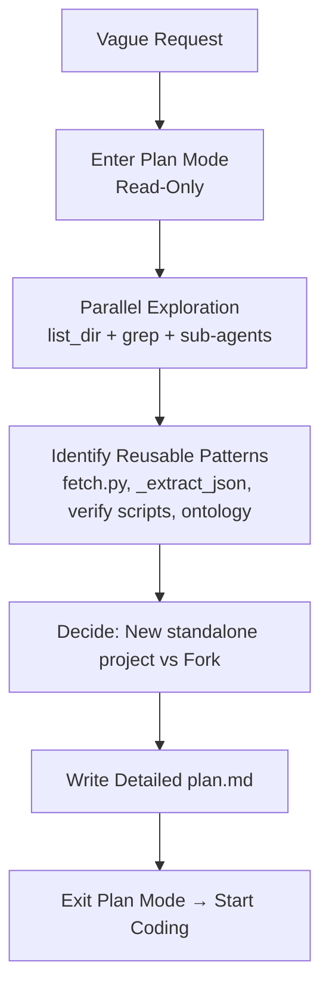
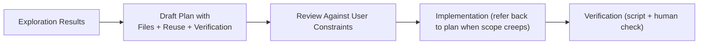
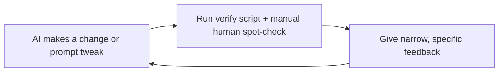

# Building a Market Research PoC with AI Assistance: A Tutorial for Developers New to AI-Powered Prototyping

**Target Audience**: Developers who are comfortable with Python but new to using AI (like Grok) as a collaborative partner for rapidly building and iterating on proof-of-concept (PoC) applications. Especially relevant if you have an existing workspace with code patterns you want to draw from.

**Goal of This Tutorial**: Walk you through the real development process we followed to build `market-research-poc` — a focused tool that, for one configured company and its subsidiaries, discovers product lines using web research + LLM. The process emphasizes iterative development, verification at each step, and leveraging AI without losing control.

This is a reflective tutorial based on an actual session, showing *how* to work with an AI like Grok effectively for PoCs, with concrete examples at every step.

**Important note on diagrams**: The process flow diagrams use Mermaid syntax (```mermaid ... ```). 

- On **GitHub**, view the file directly at https://github.com/jayferguson/market-research-poc/blob/main/DEVELOPMENT_TUTORIAL.md (Mermaid renders as interactive diagrams). Do **not** click "Raw".
- In **VS Code**, install the "Mermaid Markdown Syntax Highlighting" extension (or similar).
- For plain text editors or unsupported viewers, ASCII/text versions are provided right after each diagram block below.
- You can also paste the Mermaid source at https://mermaid.live to render it.

---


## 1. Starting Vague and Clarifying Requirements

**What happened**:

The session started with a very vague query:

> "Market Research"

This is extremely common when working with AI on new ideas — the human has a rough concept but hasn't fully articulated scope, constraints, or success criteria.

The key clarifying message that became the project charter:

> "we are building a market research proof of concept app. We will do iterative development of features as we verify each step. Start with a specified company, determine the product lines of the company. later we will add: determine vertical market, identify sales opportunities given the product line and vertical market."

A few messages later the user added critical constraints:

> "This is different from crosssell"  
> "this is a new project and not the SalesCrossSell project"

**Example of how we used the AI for clarification** (you can copy this pattern):

After the first messages, we effectively had the AI help produce scope boundaries. A reusable prompt for your own projects:

> "Help me write a crisp Project Charter for a new AI-assisted market research PoC. Constraints: single configured company + its subsidiaries only (not a multi-tenant tool), start extremely narrow with 'determine product lines', use iterative development with explicit verification after each feature, different from my existing SalesCrossSell project. Output as a short markdown document with Scope, Non-Goals, Success Criteria, and Tech Constraints."

**Practical tip**: After a vague start, ask the AI to produce a short "Project Charter" or "Current Scope" document. Save it as `CHARTER.md` or `SCOPE.md`. It becomes your north star and prevents the AI from drifting.

---

## 2. Exploration Before Implementation (The "Plan Mode" Phase)

**What happened**:

The environment has a "plan mode" that forces the AI to only read/explore (no edits allowed) until a plan is written.

We used:

- `list_dir`, `read_file` (with offset/limit for large files), `grep`
- `run_terminal_command` for inspection
- `spawn_subagent` with `subagent_type="explore"` for parallel deep dives (one on SalesCrossSell patterns, one on AIE DataManager suitability for modeling Company/ProductLine/VerticalMarket)

**Concrete example of exploration output** (what the AI reported back):

- Found excellent polite fetch logic in `SalesCrossSell/python_app/salescrosssell/fetch.py` (RateLimiter, robots.txt, clean text).
- Found robust `_extract_json` in their llm.py.
- Found AIE had rich ontology modeling (DataManager with PartOf, Characteristic, source tracking) that could model Company → Subsidiary → ProductLine — saved as future idea in IMPROVEMENTS.md.
- Common patterns across workspace: raw sqlite3, OpenAI-compatible clients for Grok or local LLMs, status callbacks for long ops, dedicated verify_*.py scripts.

**Important decision** (documented in the plan):

Build a *new standalone project* (`market-research-poc`) instead of forking SalesCrossSell. Reason: user explicitly said "new project", and we wanted to keep scope extremely narrow for the first slice.

**Diagram: Exploration & Planning Flow**



**Text/ASCII version (for plain text viewers or if Mermaid doesn't render):**

```
Vague Request
      |
      v
Plan Mode (Read-Only)
      |
      v
Parallel Exploration (list_dir + grep + sub-agents)
      |
      v
Identify Reusable Patterns (fetch.py, _extract_json, etc.)
      |
      v
Decide: New standalone project vs Fork
      |
      v
Write Detailed plan.md
      |
      v
Start Coding
```

**Practical tip for you**:

Ask your AI: "Spawn an explore sub-agent to find all existing patterns in my workspace for polite web scraping + LLM JSON extraction. Output with file paths and 3-5 line code examples for each reusable piece."

Then copy the good parts (with clear "Adapted from..." comments).

---

## 3. Writing (and Following) a Detailed Plan

**What the plan contained** (key excerpts):

- **Context**: Single company + subsidiaries, product lines first, iterative + verify each step, new project.
- **Recommended Approach**: Standalone Python, ResearchContext for testability (inject llm_client, status_callback, db_path), polite fetch + LLM, simple SQLite, CLI primary + Streamlit secondary.
- **Critical Files**: Listed every file + one-sentence responsibility.
- **Existing Code to Reuse (with exact paths)**:
  - `SalesCrossSell/python_app/salescrosssell/fetch.py` → polite fetch + RateLimiter + robots
  - `.../llm.py` → `_extract_json` and llm_analyze wrapper
  - `.../db.py` → upsert + clear patterns
  - AIE patterns for future rich modeling (documented in IMPROVEMENTS.md)
- **Verification Section**: Dedicated `verify_product_lines.py` that asserts ≥2 lines, sources present, writes timestamped report, plus mandatory manual web spot-check by human.

**Example verification language from the plan**:

"Run for fixed sample companies (Harvard BioScience, 3M, etc.). Assert len(lines) >= 2, all have name+desc, at least one source url per line or overall. Write `reports/verify_YYYYMMDD.json`. Human must manually visit the company's products page and confirm coverage."

**Lesson**: The plan acted as a contract. It prevented scope creep ("just add vertical markets now") and made the implementation and verification almost mechanical.

**Diagram: From Plan to Code**



**Text/ASCII version (for plain text viewers):**

```
Exploration Results --> Draft Plan --> Review Constraints --> Implementation --> Verification
```

**Practical tip**: After exploration, ask the AI to output a plan in a strict template (Context, Recommended Approach, Critical Files, Existing Code to Reuse with paths, Verification strategy). Then *make the AI re-read the plan.md* at the start of every major implementation turn.

---

## 4. Scaffolding the Project

We created this clean structure early:

```
market-research-poc/
├── market_research/
│   ├── config.py          # env loading + build_llm_client (OpenAI compat for Grok or local)
│   ├── fetch.py           # polite httpx + RateLimiter + robots.txt + Brave/DDG
│   ├── llm.py             # llm_analyze + robust _extract_json
│   ├── storage.py         # raw sqlite3 helpers (upsert, clear, list)
│   ├── pipeline.py        # ResearchContext + determine_product_lines (the heart)
│   ├── cli.py             # typer: research, show, clean
├── app.py                 # Streamlit UI
├── verify_product_lines.py
├── .env.example
├── .gitignore (hardened)
├── IMPROVEMENTS.md        # parking lot for alternatives
├── start.ps1 / start.sh
└── README.md
```

**Important early decision**: Everything is driven from `TARGET_COMPANY` in `.env`. This enforced the user's "one company + subsidiaries only" rule from day one.

We also created launchers (`start.ps1`, `start.sh`) that handle venv creation so a new developer can just run one command and be productive.

We centralized all logic for creating the connection to the AI model (whether the real Grok service or a local model like Ollama) into a single helper function in the configuration module. This function read the necessary credentials and endpoint URL from environment settings and returned a ready-to-use client object. By doing this early, we could easily switch between using the cloud-based Grok API and a completely local model just by changing a couple of environment variables or the .env file — with no other code changes required anywhere in the project. This kind of centralization is a good practice when building any tool that talks to an LLM, because model endpoints and authentication details often change during development and testing.

---

## 5. Core Technical Implementation (Iterative, with Real Examples)

### Polite Web Research Layer

See `fetch.py`. We adapted (with credit comments) the RateLimiter + robots.txt cache + simple HTML cleaning from the workspace.

**Example of how testing was performed during development**:

A simple one-line Python invocation was used repeatedly to fetch a specific page from a target company's website and print the first few hundred characters of cleaned text. This let the developers quickly see whether the polite fetching logic (rate limiting and robots.txt respect) was working and whether the page content looked usable for the next extraction step. The same pattern was used for many different company and subsidiary URLs during debugging.

**Why polite?** Real-world PoCs that hammer sites get blocked or cause ethical issues. We were hitting real company sites repeatedly during iteration.

---

### LLM Structured Extraction — The Attribution Evolution (The Heart of the Project)

**Early approach (v0.1–v0.2) — The problem**

We did one big scrape of the main company site + search results, combined the text, and asked the LLM to tag each line with a "subsidiary" field.

**User feedback (exact quote)**:

> "all product lines are shown as \"Main Company\" this is not correct, create an additional step that researches each subsidiary for the product line"

**The fix (v0.3) — Per-entity targeted research**

After discovering subsidiaries (and their websites when available), we now loop over the main company + each subsidiary and research them **separately**.

After the list of subsidiaries (and their websites, when available) had been discovered and stored, the main research function built a list of "entities" to process: the main company itself plus each subsidiary. It then looped over this list and, for every entity, performed a completely separate research pass. This meant fetching content specifically associated with that entity's own website and running searches scoped to that entity's name. The results from all these independent passes were collected together. This approach made it much more reliable to know which product lines actually belonged to which subsidiary, rather than hoping a single large language model call on mixed content would figure it out correctly.

The helper `extract_product_lines_for_entity` does:
- Fetches pages from *that specific entity's website* (if we have it) + runs a search scoped to that entity name.
- Feeds the (much cleaner) content to the LLM with a prompt that explicitly says:

> "Extract product lines **only for the specific entity \"X\"** (part of the larger company \"Y\"). ... subsidiary: null or \"X\" ... Be strict about attribution to this entity. Return ONLY a JSON array."

**Process Flow Diagram (Before vs After)**

```mermaid
graph TD
    subgraph "v0.1-v0.2 (Mixed Content - Fragile Attribution)"
        A1[Broad scrape of main + searches] --> B1[One giant mixed text blob]
        B1 --> C1[LLM tries to guess which lines belong to which sub]
        C1 --> D1["Mostly \"Main Company\" or wrong attribution"]
    end

    subgraph "v0.3 (Per-Entity - Reliable Attribution)"
        A2[Discover subs + their websites] --> B2[Loop over Main + each Sub]
        B2 --> C2["Fetch pages FROM this entity's own site + entity-specific search"]
        C2 --> D2["Scoped LLM prompt: ONLY for this exact entity"]
        D2 --> E2[Correct subsidiary tag driven by source]
    end
```

**Text/ASCII version (for plain text viewers):**

```
v0.1-v0.2 (Mixed)                  v0.3 (Per-Entity)
-----------------                  -----------------
Broad mixed scrape   ===>          Discover subs + websites
       |                                  |
       v                                  v
Mixed text blob                       For each entity:
       |                           Fetch its own site + search
       v                                  |
LLM guesses attribution                   v
       |                           Scoped prompt "ONLY for X"
       v                                  |
Mostly "Main Company"                 Correct attribution
```

```
```

**Result**: Lines now correctly get attributed to the right subsidiary because the content came from that subsidiary's own pages and the prompt forced the scope.

This pattern (per-entity scoped research instead of one big mixed call) is the single most valuable technical lesson from the whole project.

The prompt given to the language model for each entity was carefully written to be very explicit about scope. It told the model the exact name of the current entity being researched, reminded it that this entity was part of a larger parent company, provided only the content that had been fetched specifically for that entity, and instructed it in strong terms to extract lines belonging only to that entity and to set the subsidiary field accordingly (or to null for the main company). The prompt also emphasized returning strict JSON only, with no extra explanation.

This kind of highly directed, entity-scoped prompting is a useful technique when you need the model to produce structured output that must be attributed to specific sources rather than hallucinated across a large body of mixed information.

### Data Model & Refresh Semantics

`storage.py` has simple helpers:

- `clear_product_lines_for_company(cid)` and `clear_subsidiaries_for_company(cid)` (called at the *start* of every research for "current best view")
- `insert_product_line(cid, name, description, ..., subsidiary=...)`
- `list_product_lines_with_sources(cid)`

**Why "clear then insert" instead of upsert per line?**
Because the LLM might return a slightly different (but better) set of lines on different days. We want the *current best view*, not a growing pile of stale extractions.

**CLI verification commands** (very useful during iteration):

The command-line interface provided simple one-word subcommands such as "clean" (to wipe previous research data for the configured company), "research" (to run the full discovery and extraction process), and "show" (to display the currently stored subsidiaries and product lines with their sources). These commands were extremely handy for rapid testing and for reproducing exact issues the user reported.

### CLI & UI - Real User Feedback Driving Changes

### CLI & UI — Real User Feedback Driving Changes

The UI went through several user-driven iterations (with exact quotes):

**User**: "i ran once from the cli and once from the streamlit ui, got duplicate product lines"

→ Added `clear_*_for_company` on every research + deduplication by (name, subsidiary).

**User**: "the subsidiaries are not being listed in the ui, under the research log it say 12 were found"

→ Made the left-column subsidiaries rendering *always* do a fresh `stg.list_subsidiaries(cid)` query every render (instead of relying only on session state). Added `st.rerun()` at the end of the research block.

**User**: "keep the subsidiaries on the left and the product lines on the right"

→ Restored proper two-column layout (`left_col, right_col = st.columns([1, 2])`).

**User**: "the subsidiaries list should be clickable to go to their website"

→ Updated the code that rendered the list of subsidiaries so that each subsidiary name became a direct hyperlink to its website (when a website URL had been discovered for it). In the rendered documentation this appears as a clickable link in the list; in the actual application code the same idea was used so that the left side of the user interface would show live links the user could click.

**User**: "all product lines are shown as \"Main Company\" this is not correct..."

→ The entire per-entity architecture described above.

**Final layout (after all feedback)**:

- Very top: single row of command buttons (Research Product Lines | Reload from DB | Clear Results)
- Below: two-column layout
  - **Left**: Target Company + Subsidiaries / Divisions list (clickable names that open the website) + compact Settings expander
  - **Right**: Product Lines (expanders start closed; inside each you see the correct subsidiary + clickable website link in the details) + Research log at the very bottom

**Diagram: Current UI Structure**

```mermaid
graph TD
    Buttons[Top: Research | Reload from DB | Clear Results] --> Layout[Two-Column Layout]
    Layout --> Left[Left Column<br/>Target + Clickable Subsidiaries List<br/>+ Settings Expander]
    Layout --> Right["Right Column<br/>Product Lines (closed expanders)<br/>with correct Subsidiary + Link inside each<br/>+ Research Log at bottom"]
```

**Text/ASCII version (for plain text viewers):**

```
         Top Buttons (Research | Reload | Clear)
                      |
         +------------+------------+
         |                         |
      Left Column               Right Column
  Target + Clickable         Product Lines
  Subsidiaries List          (closed expanders
  + Settings                 with sub links)
         |                         |
         +------------+------------+
                      |
              Research Log (bottom)
```

---

## 6. Verification & Iteration Discipline — With Real Examples

We created `verify_product_lines.py` that:

- Loads the configured `TARGET_COMPANY`
- Calls `determine_product_lines(ctx)`
- Asserts basic quality: `len >= 2`, all have names, sources attached
- Writes a timestamped JSON report to `reports/`
- Prints a summary and explicitly reminds the human:

> "NEXT: Manually review one report + visit 1-2 company sites to confirm major lines captured."

**Real usage pattern** (what we actually did after every significant change to the extraction logic):

We would run the verification script, which produced a fresh timestamped report file. We would then open that report and also manually visit the target company's public website (products and about pages). We compared the extracted lines against what a human could see on the real site and gave the AI very specific feedback such as "these three lines that appear on the subsidiary's own site are still missing from the output" or "this line is being incorrectly attributed to the parent company instead of the subsidiary." This kind of concrete, evidence-based feedback was then used to refine the prompts or the per-entity fetching logic in the next iteration.

**Diagram: The Actual Development Engine**



**Text/ASCII version (for plain text viewers):**

```
AI change --> Run verify script + manual human spot-check --> Give narrow, specific feedback --> AI change (loop)
```

**Tutorial takeaway**: When using LLMs, your verification loop must include both automated gates *and* cheap human judgment. The AI cannot be the only judge of correctness.

---

## 7. Version Control, Secrets, and Publishing

**Exact sequence we ran** (described in words):

After all the source files were in place, we initialized a new local git repository in the project folder, staged all the files (the .gitignore already prevented secrets and build artifacts from being included), and made the first commit with a clear message. Later we added a .gitattributes file for consistent line endings across Windows and other systems and committed that too. We then created the empty repository on GitHub (using the environment's GitHub integration tools so we didn't have to do it manually in the browser) and added it as the "origin" remote. Finally we pushed the main branch, which made the full project history, including the IMPROVEMENTS.md file that captured all the alternative ideas, visible on GitHub.

**When the user said "make sure there are no keys exposed in the repo"**:

We ran explicit audits:
- `git grep -E "sk-[A-Za-z0-9]{20,}|xai-[A-Za-z0-9_-]{30,}"` locally
- Used MCP `search_code` on the remote repo for key patterns
- Inspected `.env` (exists locally but correctly ignored; real key only ever lived there)

**Result**: The GitHub repo contains only safe code and placeholders. The real key only ever lived in the developer's local (correctly gitignored) `.env`.

We also created and committed `IMPROVEMENTS.md` specifically to save all the alternatives discussed for later.

---

## 8. How We Leveraged the Full AI Environment

- **Plan mode** + spawned `explore` sub-agents for safe, parallel deep exploration
- **MCP tools** (`grok_com_github__create_repository`, `search_code`, `get_file_contents`, etc.) for creating the repo, inspecting the remote, secret scanning attempts, etc.
- **Direct terminal + Python execution** for instant testing ("run this exact function against my real company data right now")
- **Iterative natural-language feedback** as the primary driver of progress

**For a developer new to this style of work**:

Treat the AI + its tools (plan mode, sub-agents, MCP, direct FS/execution) as a very fast, very knowledgeable pair programmer + research assistant that has read your entire workspace.

Your job is still to:
- Give clear direction and hard constraints
- Demand verification (scripts + human judgment)
- Make the final architecture decisions
- Keep the human in the loop for correctness

---

## 9. Current State (v0.3) — What You Can Run Today

The project supports:

- One configured company (`TARGET_COMPANY` in `.env`) + its subsidiaries
- Accurate per-entity product line discovery with evidence
- CLI (research / show / clean)
- Streamlit UI (top buttons row, left clickable subs, right product lines in closed expanders with sub details)
- Verification script that produces timestamped reports
- Clean git history on GitHub with no exposed keys

**Try it yourself** (after filling `.env` with real keys):

After setting the target company name and providing valid API keys in the environment file, a developer could run the command-line tool to perform a full research pass, use the "show" subcommand to inspect the stored subsidiaries and attributed product lines, launch the Streamlit graphical interface for a more visual exploration, or execute the dedicated verification script that both checks basic quality rules and produces a timestamped report file for comparison against previous runs.

---

## 10. Lessons Learned & Recommended Next Steps

**Biggest lessons**:

- LLM attribution from one big mixed scrape + weak prompting is fragile. Per-entity targeted fetching + strongly scoped prompts is dramatically better.
- Build the verification loop (automated gates + mandatory cheap human spot-checks) early. It is your safety net against LLM non-determinism.
- Document alternatives early (`IMPROVEMENTS.md`). Future you will not remember the good ideas you had.
- The real quality comes from tight human-AI feedback loops with real usage data, not from perfect initial plans.
- Treat secrets as first-class from the first commit. Use the AI to help audit.

**Concrete exercises for you**:

1. Read `IMPROVEMENTS.md` and implement one item (e.g. the post-extraction domain validation for subsidiary attribution).
2. Add a `confidence` score to the extraction and surface low-confidence lines in the UI with a warning color.
3. Take a completely different narrow domain and go through the same phases we did: clarify → explore your workspace → plan → per-"thing" extraction → verify loop with human checks.

---

*See `IMPROVEMENTS.md` in the same directory for the full raw list of alternatives we deliberately parked for later work.*

**End of tutorial.**

